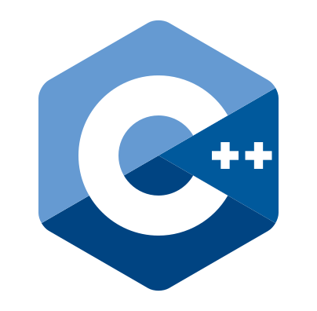
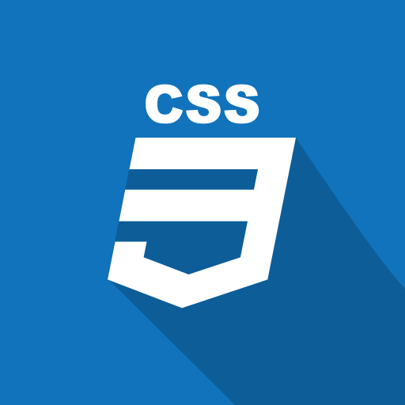

  

I’m a <strong>tech enthusiast and lifelong learner</strong> deeply passionate about computer science, modern
software development, and exploring the endless possibilities of programming. My curiosity spans <strong>coding, electronics,
3D printing, and diving into new languages, frameworks, and computational concepts.</strong> 

<h2> 🚀 &nbsp;Some Tools I Have Used and Learned</h2>

